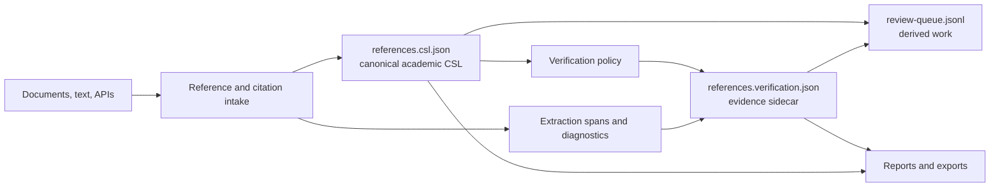
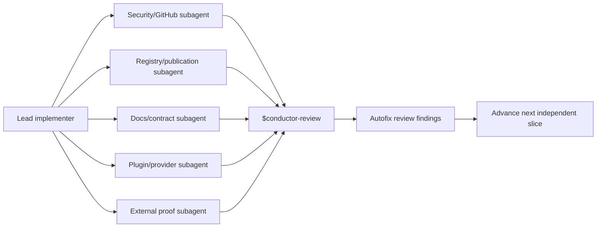
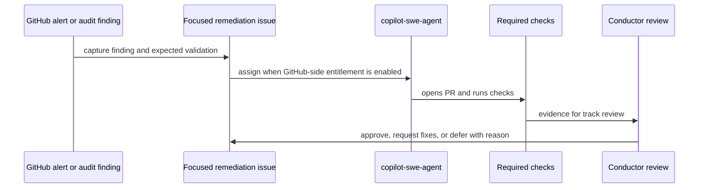
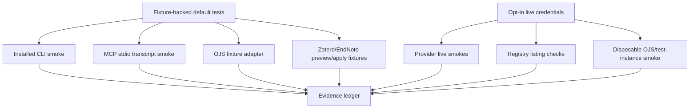
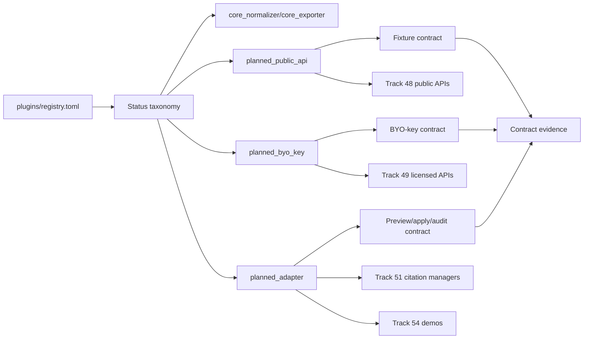
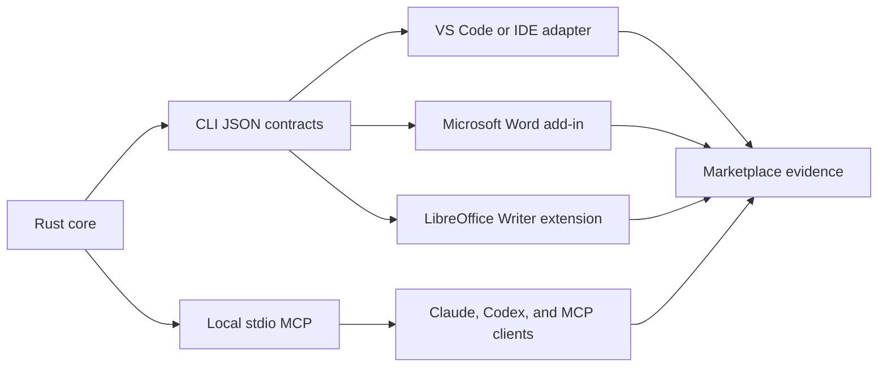
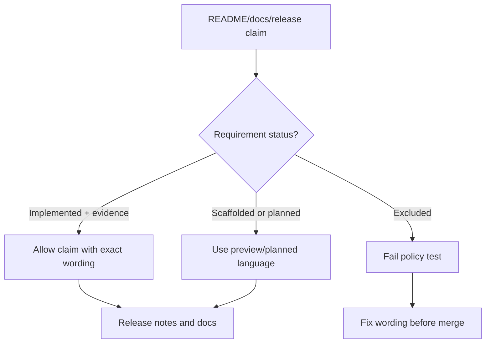

# Sourceright Conductor Design

This Conductor design document maps the implementation tracks to the product
architecture and the completion evidence contract. It is the planning companion
to `conductor/requirements.md`.

## Source-Of-Truth Boundaries

## Remaining Work Dependency Graph

```mermaid
flowchart TB
    T41[41 Security/publication/contract governance]
    T42[42 GitHub automation and alert operations]
    T43[43 Publication registry completion]
    T44[44 Branch triage and stale-work closure]
    T45[45 External proof suites]
    T46[46 Plugin/provider roadmap delivery]
    T47[47 Contract evidence and overclaim gates]
    T48[48 Public API providers]
    T49[49 Licensed BYO-key providers]
    T50[50 Repository record providers]
    T51[51 Citation-manager proof]
    T52[52 Non-provider plugins]
    T53[53 CourtListener legal provider]
    T54[54 Demo proof]
    T55[55 Benchmark robustness]
    T56[56 MCP registry binding]
    T57[57 Smithery distribution]
    T58[58 Mature Zotero plugin]
    T59[59 Other citation managers]
    T60[60 Mature OJS plugin]
    T61[61 Streamlit publication]
    T62[62 Expanded normalisers]
    T63[63 Plugin supply-chain]
    T64[64 GitHub governance]
    T65[65 AI client MCP packaging]
    T66[66 VS Code extension packaging]
    T67[67 Word add-in packaging]
    T68[68 LibreOffice extension packaging]
    T69[69 Marketplace submission evidence]
    T36[36 DOCX/PDF extraction]
    T37[37 Live core providers]
    T38[38 Citation disambiguation]
    T39[39 URL/archive integrity]
    T40[40 Low-noise writeback]

    T41 --> T42
    T41 --> T43
    T41 --> T47
    T44 --> T46
    T36 --> T45
    T37 --> T45
    T38 --> T45
    T39 --> T45
    T40 --> T45
    T46 --> T45
    T45 --> T47
    T46 --> T48
    T46 --> T49
    T46 --> T50
    T46 --> T51
    T46 --> T52
    T46 --> T53
    T45 --> T54
    T45 --> T55
    T43 --> T56
    T56 --> T47
    T43 --> T57
    T51 --> T58
    T51 --> T59
    T45 --> T60
    T54 --> T61
    T46 --> T62
    T46 --> T63
    T42 --> T64
    T56 --> T65
    T57 --> T65
    T64 --> T65
    T63 --> T66
    T65 --> T66
    T36 --> T67
    T40 --> T67
    T63 --> T67
    T36 --> T68
    T40 --> T68
    T63 --> T68
    T65 --> T69
    T66 --> T69
    T67 --> T69
    T68 --> T69
```

## Parallel Subagent Model

Subagents may run concurrently for discovery, fixture design, and non-overlapping
patches. Workers must declare owned paths before editing. Review findings are
fed back into the same slice before the next phase begins.

## Security And GitHub Automation

Repo files prepare Copilot, Renovate, Dependabot alerts, CodeQL, cargo audit,
and Scorecard. GitHub account settings, installed Marketplace apps, and email
notification preferences remain outside repo control.

## External Proof Architecture

Default CI proves deterministic behavior. Live or hosted services are explicit
opt-in jobs with credentials, fixture data, cache/rate-limit controls, and clear
skip reasons.

## Plugin Roadmap Delivery

Every plugin manifest needs a track owner, status, fixtures, docs, and test
gate. Planned plugins stay visibly planned until implementation evidence exists.

## Host Packaging Architecture

Host packages are thin adapters. They may call CLI JSON or MCP resources, but
they must not reimplement verification logic, silently write canonical CSL, or
claim marketplace availability before accepted listing evidence exists.

## Anti-Overclaim Gate

Release wording must align with evidence levels. Claims such as
"examiner-grade final verifier", "AI detector", "production-ready institutional
platform", and "SOTA benchmarked performance" stay blocked until the contract
explicitly changes.
