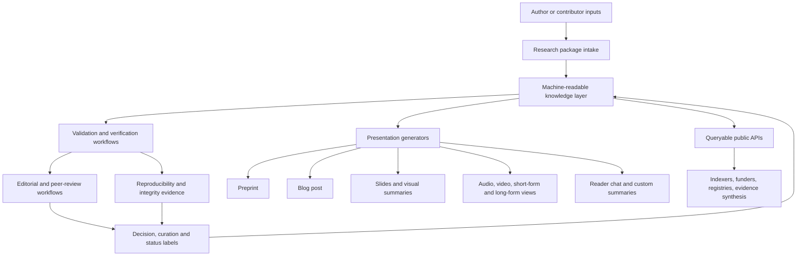
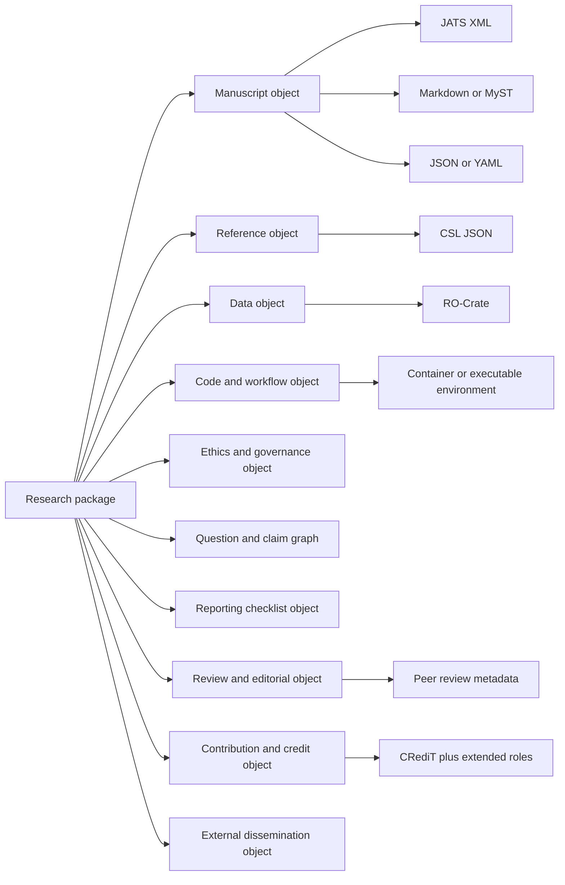
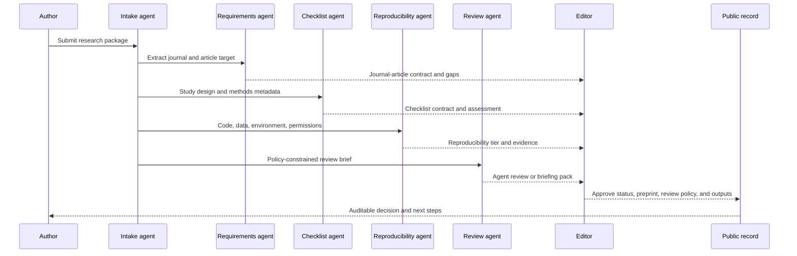
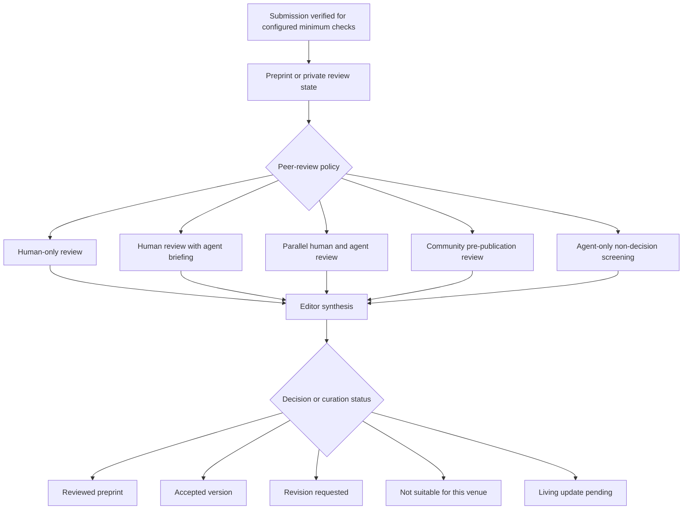
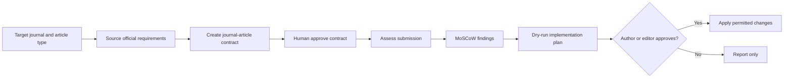
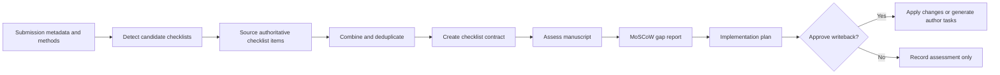
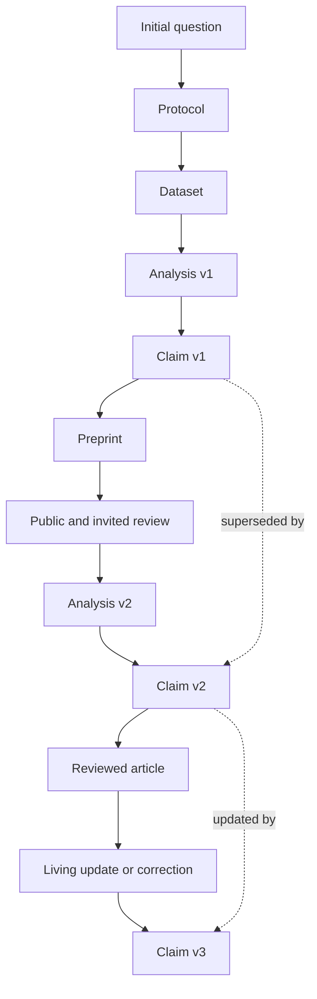
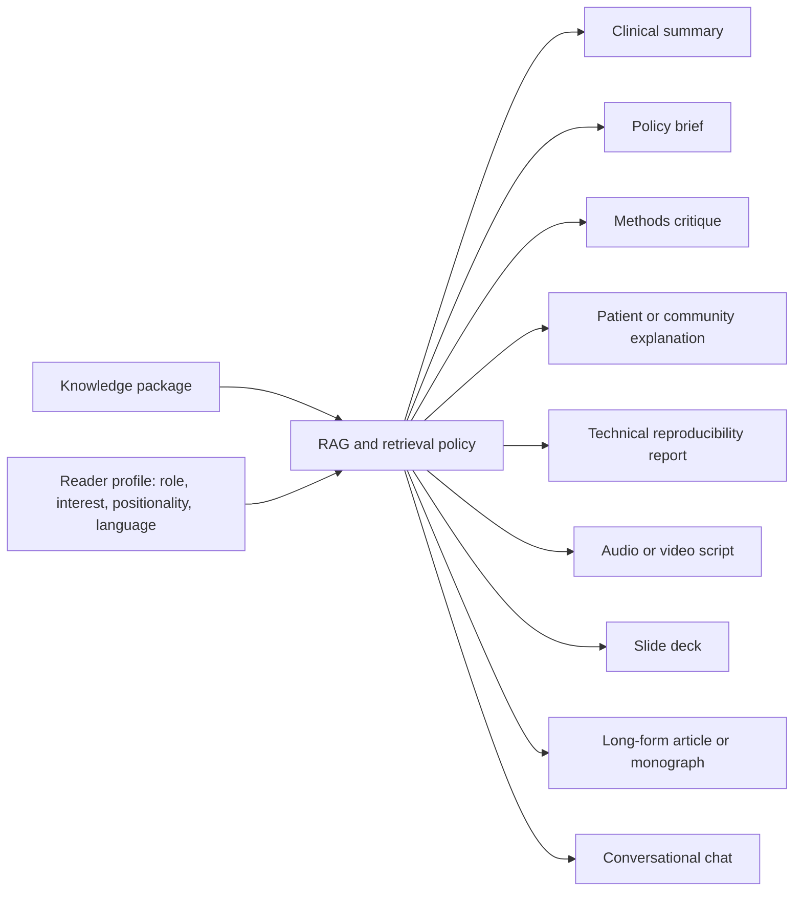

# Future Scholarly Communication Design

## Architecture principle

The platform should separate the knowledge layer from presentation layers. The knowledge layer is a versioned, machine-readable research project graph. Manuscripts, preprints, blog posts, slide decks, audio, video, monographs, peer-review views, editor views, reader chats, and indexing feeds are generated or curated views over that graph.

## Layered architecture

## Submission package architecture

## Agent-first workflow model

Agents operate on contracts, not on hidden prompts or unstructured manuscript uploads. Each agent must declare its input contract, output contract, tool version, model version where relevant, policy mode, confidence, limitations, and human approval requirement.

## Configurable peer-review modes

## Journal requirement workflow

## Reporting checklist workflow

## Knowledge graph evolution

The graph should support changes in question, data, analysis, interpretation, evidence status, and dissemination. A contradiction between a preprint claim and a later interpretation should be represented as a temporal state change with provenance, not as an unexplained inconsistency.

## Reader-chosen presentation layer

## Governance design

- Every agentic action is logged with inputs, outputs, model or tool version, policy profile, confidence, and human approval state.
- Every write-capable workflow supports dry-run first and explicit apply.
- Every public status label is derived from explicit event records.
- Every contribution is attributed and typed, including peer review, editorial work, translation, human verification, reproducibility, code review, and data curation.
- Every external integration remains evidence-gated before support claims are made.
