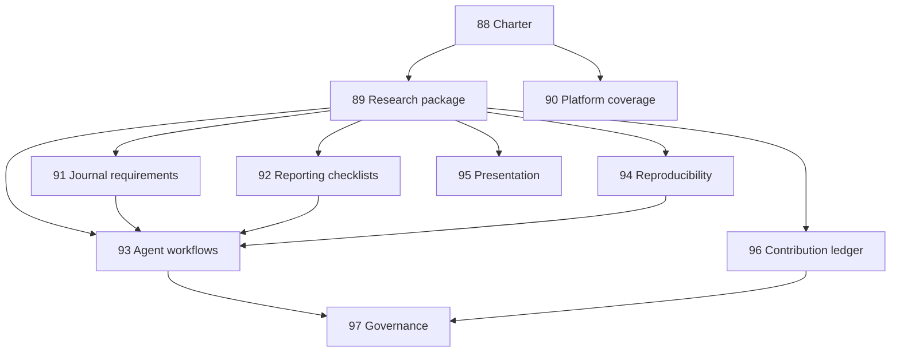

# Future Scholarly Communication Track Map

## Programme tracks

| Track | Title | Purpose |
| --- | --- | --- |
| 88 | Transforming Health programme charter | Define the transformative publishing project, scope, economics, contribution model, and open-source self-improvement loop. |
| 89 | Machine-readable research package and knowledge graph | Define the package, graph, data, code, protocol, reference, manuscript, and metadata architecture. |
| 90 | Open platform and preprint coverage | Extend platform coverage across open journal, publishing, preprint, overlay, repository, and review systems. |
| 91 | Journal-article requirements contract workflow | Source journal and article requirements, create a contract, assess submissions, make MoSCoW recommendations, and optionally implement approved changes. |
| 92 | Reporting checklist contract workflow | Detect relevant reporting checklists, source and combine items, assess the manuscript, make MoSCoW recommendations, plan, and optionally implement approved changes. |
| 93 | Agent-first editorial workflow engine | Make editorial workflows configurable from fully human to agent-assisted to parallel human-agent comparison. |
| 94 | Reproducibility, replication, and executable evidence | Assess or rerun data, code, environments, and replication feasibility with explicit evidence tiers. |
| 95 | Multi-format presentation and reader interaction | Generate preprint, blog, slides, audio, video, short form, long form, monograph, and chat interfaces from the same package. |
| 96 | Contribution ledger and publishing economics | Credit peer review, editorial work, verification, translation, data, software, platform development, and commissioning contributions. |
| 97 | Governance, identity, transparency, and anti-gaming | Define editorial AI governance, human oversight, identity, conflicts, transparency, privacy, incentives, and abuse controls. |

## Dependencies

## Implementation sequencing

1. Charter and boundaries, Tracks 88 and 97.
2. Core research package and contracts, Track 89.
3. Requirements and checklist workflows, Tracks 91 and 92.
4. Platform and preprint coverage, Track 90.
5. Agent workflow orchestration and policy modes, Track 93.
6. Reproducibility and executable evidence, Track 94.
7. Presentation surfaces and reader interaction, Track 95.
8. Contribution ledger and economics, Track 96.

## Evidence gates

Each track must include:

- Scope and out-of-scope boundaries.
- Machine-readable contract or schema where applicable.
- Privacy and human approval boundaries.
- Test matrix.
- Claim boundary.
- At least one synthetic fixture before implementation claims.
- Official-source evidence for platform, journal, checklist, or repository-specific claims.
