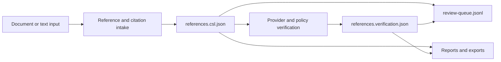
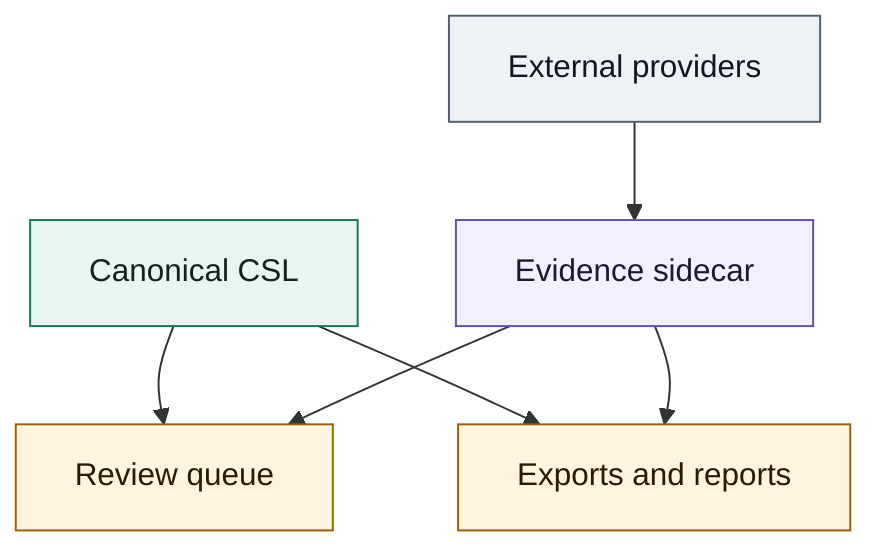
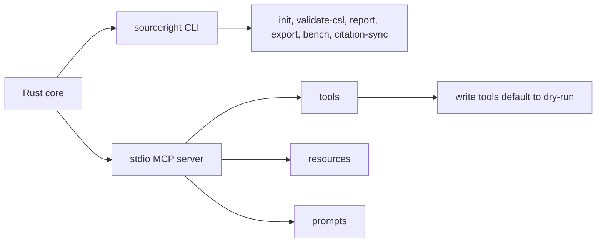
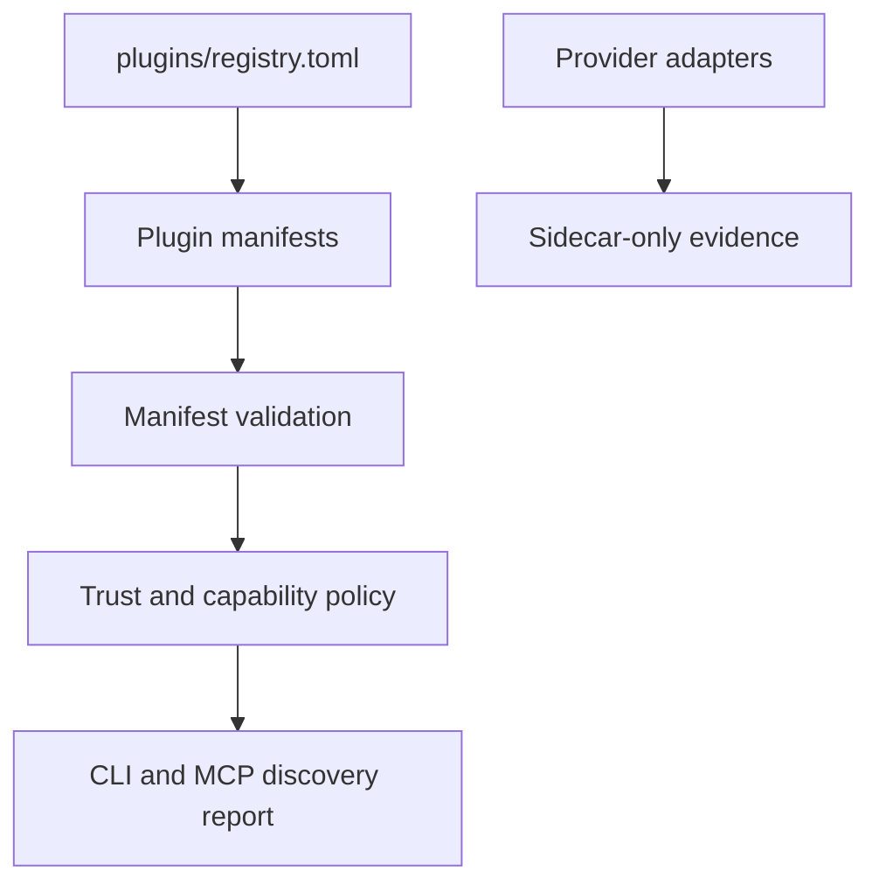
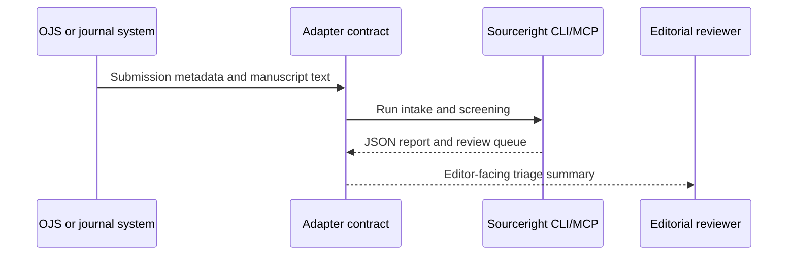
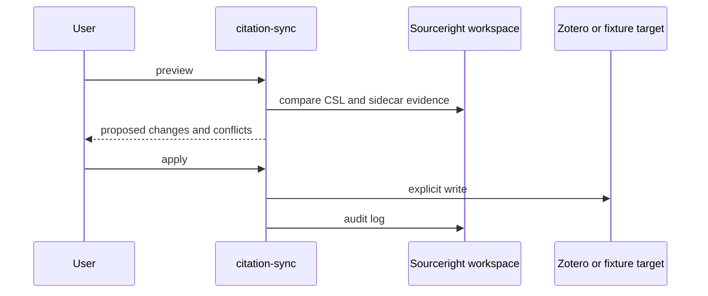
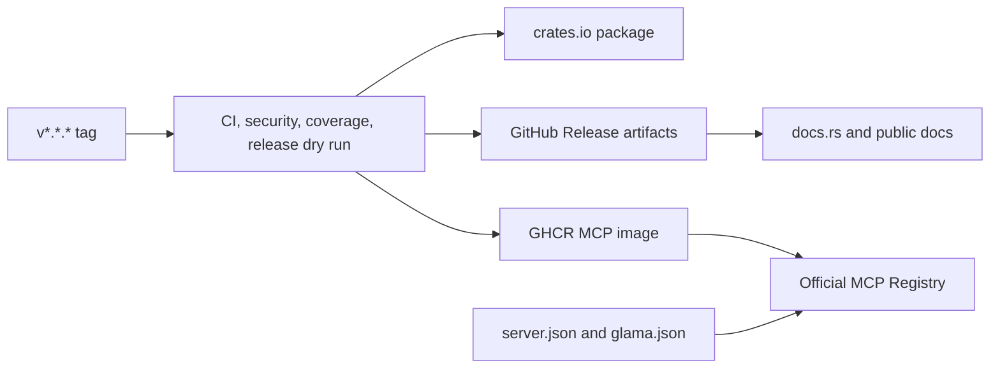

# Design

This design document explains the architecture behind the feature contract. The
Conductor-owned planning authority is `conductor/design.md`; this page mirrors
the same architecture for users and contributors. It is intentionally
contract-first: public claims, tests, and Conductor tracks should stay
consistent with these boundaries.

## Scope

Sourceright is a Rust-first reference triage and verification system. The core
accepts text or document-derived references, builds canonical CSL, records
evidence in a sidecar, routes ambiguity to review, and exposes reports, exports,
CLI commands, and MCP surfaces.

## Data Boundaries

Canonical CSL stays clean. Provider records, provenance spans, confidence, and
conflicts live in the sidecar. Review queues and reports are derived artifacts.

## CLI And MCP Surfaces

CLI and MCP are two adapters over the same Rust core. Public JSON outputs are
treated as contracts, and write-capable MCP operations must remain dry-run first
with explicit apply semantics.

## Providers And Plugins

Plugins declare capabilities and network/auth requirements. Provider adapters
may enrich evidence, but they do not overwrite canonical CSL.

## Journal Integration

OJS is the first public journal target because it is open source and has a
plugin ecosystem. Other platforms should use the same screening contract before
any platform-specific writeback.

## Citation Manager Sync

Citation-manager sync defaults to preview. Apply operations must be explicit,
audited, and conflict-aware.

## Release And Registry Flow

Publication evidence must separate accepted listings from prepared or submitted
metadata. Future package-manager channels should be added only when they have a
maintainable manifest and validation path.
